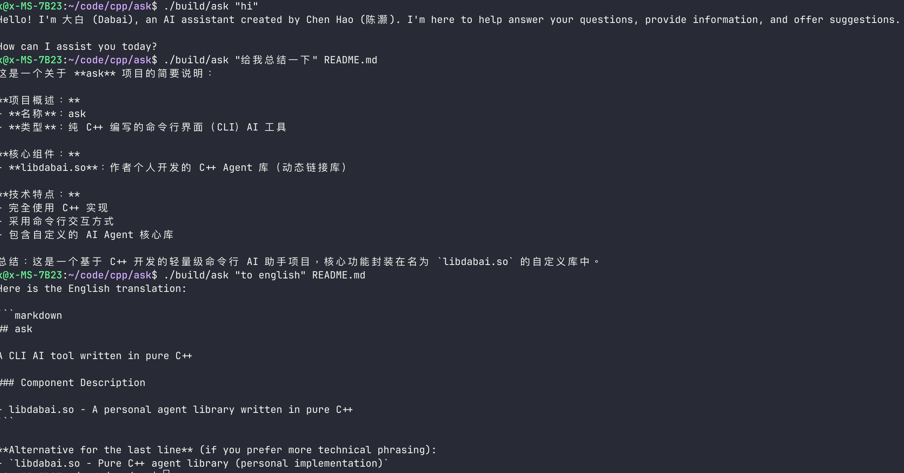

# ask

A CLI AI tool written in pure C++.

> **Note:** This is the English version. For Chinese documentation, see [README_cn.md](./README_cn.md).

## Components

- `libdabai.so` — A personal Agent library written in pure C++

## Configuration

> This tool was created for personal exploration of writing Agents in C++, so not all models are supported.
>
> Currently only the `kimi-k2.5` model is supported. Configure your `api key` in `setting.json` and it should work.

## Environment

- Ubuntu 22.04

## Dependencies

- libcurl

## Usage

```bash
./ask <question> [files]...
```

### Examples

```bash
./ask "Hello"
./ask "Explain code" code.cpp
./ask code.cpp "Explain"
./ask "Analyze" log1.txt log2.txt
```


